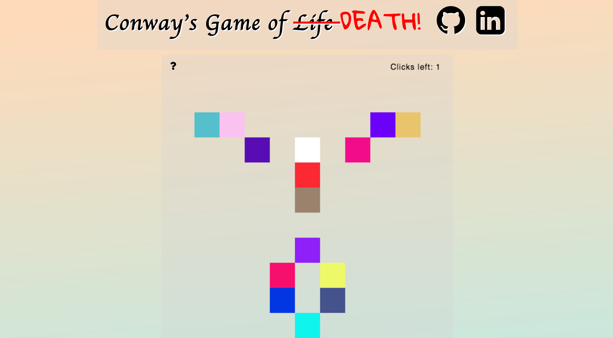

## Conway's Game of ~~Life~~ DEATH!

[Website][website]

[website]: https://chrabyrd.github.io/game_of_death

## Minimum Viable Product

- [x] Start, pause, and reset each level on the game board
- [x] Select squares to be alive at any point during play
- [x] See the amount of time left to complete the level
- [x] An About modal describing the rules of the game

### Background

Conway's Game of Life is a classic example of the concept of **cellular automata**.  The original GoL is a 0-player game that plays out on a rectangular grid.  Each cell on the grid is either dead or alive when the game begins.  On the next iteration of the game (called a "generation") the cells follow these rules:

1) Any live cell with 2 or 3 live neighbors (defined to be the eight cells surrounding it) stays alive,
2) Any dead cell with exactly 3 neighbors will come to life,
3) Any live cell with less than 2 neighbors or more than 3 neighbors will die.

### The Game

The theory behind Conway's Game of Life has always fascinated me, but I felt like it was a missed oppurtunity that it hasn't been turned into a single-player game. There is only one level now, as proof-of-concept. The grid continuously updates in the background, giving the patterns the appearance of motion. The object of each level is to "clear" grid by activating the proper cells within a given time limit. The player will not be able to manually deactivate any tiles.

<p align="center">
  
</p>

### Features and Implementation

The logic of the game is split into four different classes.

#### Cell

[Cell.js][cell]

Each `cell` is constructed with a list of its neighbors, as well as an `alive` state. It's also constructed with a min/max `x` and `y` value, as that was the only way to divide the HTML5 canvas into a clickable grid.

### Board

[Board.js][board]

The `board` acts as a container to the cell class. It keeps track of the cells, and holds the functionality of changing each cell's `alive` state on click. See the code below.

```javascript

  const clickedCell = this.cells.find((cell) => {
    if (e.offsetX >= cell.xmin && e.offsetX <= cell.xmax) {
      if (e.offsetY >= cell.ymin && e.offsetY <= cell.ymax) {
        return cell;
      }
    }
  });

  if (!clickedCell.alive) clickedCell.changeState();

```

### Automata

[Automata.js][automata]

The `automata` is the engine driving the game. It has a single function `neighborLogic`, which is used to decide which cell should be "alive" or "dead."

### Game

[Game.js][game]

The `game` encloses the previous three components, and adds timing events to turn Conway's Game of Life from a 0-player game to a single player game.

[cell]: ./scripts/cell.js
[board]: ./scripts/board.js
[automata]: ./scripts/automata.js
[game]: ./scripts/game.js

## Future

There are several features that will be added to this project in the future.

- The automata engine is flawed. Since it changes each cell's `alive` state in real time, instead of performing a deep-dup, the logic surrounding the structures is asymmetrical.

- More levels, containing patterns of increasing difficulty. This is best accomplished by making a `Level` class.

- The ability to keep a cumulative score persisted between levels.
