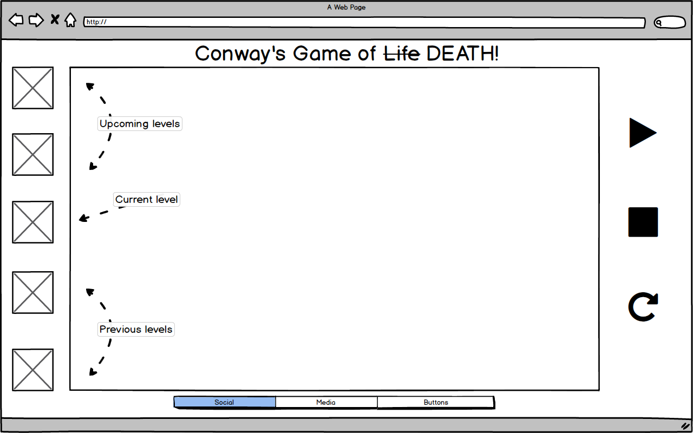

## Conway's Game of ~~Life~~ DEATH!

### Background

Conway's Game of Life is a classic example of the concept of **cellular automata**.  The original GoL is a 0-player game that plays out on a rectangular grid.  Each cell on the grid is either dead or alive when the game begins.  On the next iteration of the game (called a "generation") the cells follow these rules:

1) Any live cell with 2 or 3 live neighbors (defined to be the eight cells surrounding it) stays alive,
2) Any dead cell with exactly 3 neighbors will come to life,
3) Any live cell with less than 2 neighbors or more than 3 neighbors will die.

### The Game

The theory behind Conway's Game of Life has always fascinated me, and I would like to take it from being a 0-player game to a single player game. The game will be broken into several levels, with each level containing a starting pattern. The grid will continuously update in the background, giving the patterns an apparent motion. The object of each level is to "clear" grid by activating a limited number of cells, but the player will not be able to manually deactivate any.

### Functionality & MVP  

With this gamified version of Conway's Game of Life, players will be able to:

- [ ] Start, pause, and reset each level on the game board
- [ ] Select squares to be alive at any point during play
- [ ] See their score, which is based on the amount of time and clicks taken to complete each level

In addition, this project will include:

- [ ] An About modal describing the background and rules of the game
- [ ] A production Readme

### Wireframes

This app will consist of a single screen with game board, game controls, nav links to my Github, LinkedIn, and the About modal. Game controls will include Start, Stop, and Reset buttons as well as a slider to control the speed. On the left will be a list of levels, with the ability to replay previously completed levels. On the right will be the control scheme, and on the bottom will be links for the player to share his/her score on social media.

### Architecture and Technologies

This project will be implemented with the following technologies:

- Vanilla JavaScript and `jquery` for overall structure and game logic,
- `Easel.js` with `HTML5 Canvas` for DOM manipulation and rendering,
- Webpack to bundle and serve up the various scripts.

In addition to the webpack entry file, there will be three scripts involved in this project:

`board.js`: this script will handle the logic for creating and updating the necessary `Easel.js` elements and rendering them to the DOM.

`automata.js`: this script will handle the logic behind the scenes.  An Automata object will hold a 2D array of `Cell`s.  It will be responsible for doing neighbor checks for each `Cell` upon iteration and updating the `Cell` array appropriately.

`cell.js`: this lightweight script will house the constructor and update functions for the `Cell` objects.  Each `Cell` will contain an `aliveState` (`true` or `false`).

### Implementation Timeline

**Day 1**: Setup all necessary Node modules, including getting webpack up and running.  Create `webpack.config.js` as well as `package.json`.  Write a basic entry file and the bare bones of all 3 scripts outlined above. Goals for the day:

- Successfully bundle with `webpack`
- Learn enough about `HTML5 Canvas` to render an empty grid on the page

**Day 2**: First, build out the `Cell` object to connect to the `Board` object.  Build in the ability to toggle the live/dead states on click for each cell.  Goals for the day:

- Complete the `cell.js` module (constructor, update functions)
- Render a square grid to the `Canvas`
- Make each cell in the grid clickable, toggling the state of the square on click

**Day 3**: Create the automata logic backend.  Build out modular functions for handling their neighbor checks and ruleset. Incorporate the automata logic into the `Board.js` rendering and finish basic UI.  Goals for the day:

- Export an `Automata` object with correct type and handling logic
- Have a functional grid on the `Canvas` frontend that correctly handles iterations from one generation of the game to the next
- Have basic UI start/pause/reset functionality

**Day 4**: Create the first level, and the ability for the player to see his or her score. Style the frontend, making it polished and professional.  Goals for the day:

- Create several levels of increasing difficulty
- Have a styled `Canvas`, nice looking controls and title
- Add ability to keep track of score

### Bonus features

I would like to continue to develop this app into a full-fledged game. Some anticipated updates are:

- [ ] Progress to more difficult levels, which can contain complex patterns
- [ ] Adding unique cell colors, or the ability for cells to change color
- [ ] Add more levels of increasing difficulty, as well as patterns of increasing complexity
- [ ] Experiment with different rulesets for potential different modes of gameplay
